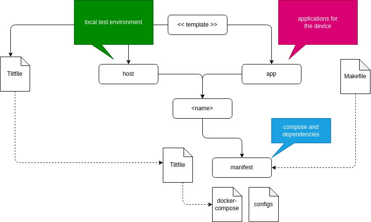

# mender-containerized-apps

Template project to create multi-application deployments for mender based systems.

## Use this Template

This is a github template project. So use "Use this template" and create a new repository for your project. 

Please make sure, that the followin github action secrets are defined:

* DOCKER_PASSWORD
* DOCKER_USERNAME
* MENDER_PASSWORD
* MENDER_SERVER_URL
* MENDER_TENANT_TOKEN
* MENDER_USERNAME

## bootstrap your device for docker-compose based application updates

requirements: 
* Ubuntu 22.04

To prepare a ubuntu based system, please login into your device and run the install script located under `hack/bootstrap.sh`.

## Add a application

Applications are located under `apps/<application>`

To add a new application, create a folder under `apps/<application>` and add a valid docker-compose file with all its configurations.
Then extend the variable `MANIFESTS_DIRS` in `Makefile` with the path to your new application. 

## Local development

To develope and test your application locally, you need to add an Tiltfile under `apps/<application>` which includes your docker-compose. 
Include the path of your Tiltfile in `Tiltfile`. 

Then `tilt up`

### developing on the device

If your device is bootstraped by the `hack/bootstrap.sh` script, your device should be ready to receive instructions by docker-compose. 

uncomment the `os.putenv('DOCKER_HOST', 'tcp://localhost:2375')` line in your `Tiltfile` and replace localhost with your device ip address.

### local test environment

The local test environment is started by `tilt up -f Tiltfile.host`. The host services are located under `host`.

## push new mender versions locally

To manually push your local changes to mender you can use the Makefile.

Please define the following environment variables:

* MENDER_SERVER_URL (when different to `hosted.mender.io`)
* MENDER_USERNAME
* MENDER_PASSWORD
* MENDER_TENANT_TOKEN

Then run `make all`.

